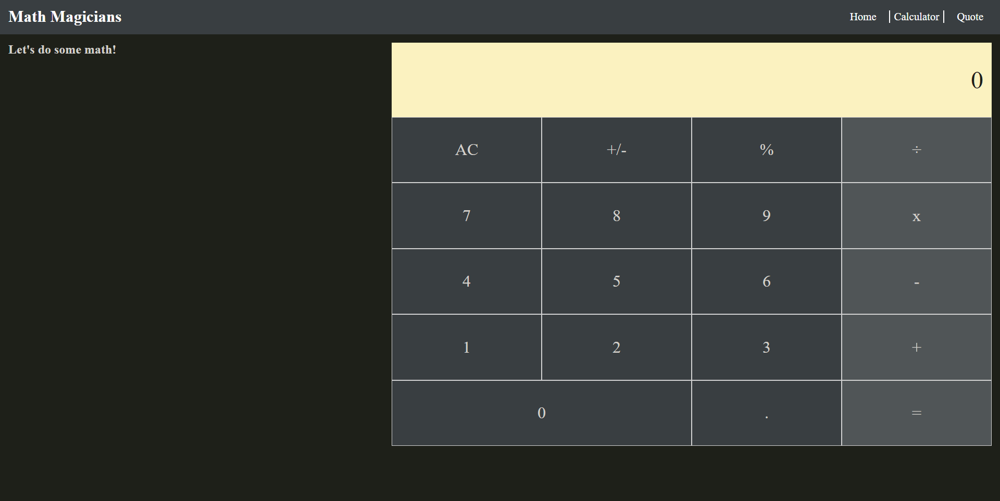

# Math Magicians

> This project has a working calculator.

This website is for Math lovers, it contains Mathematicians quotes and a calculator.

## Live Server

In the following link, you can view the [Math Magicians website Netlify](https://guerreiropedr0-math-magicians.netlify.app) or [Math Magicians website Heroku](https://guerreiropedr0-math-magicians.herokuapp.com/)

## Built With

- HTML
- CSS
- JAVASCRIPT
- REACT

## Getting Started

Start by cloning the repository.

`git clone git@github.com:guerreiropedr0/math-magicians.git`

Navigate to the created folder.

`cd math-magicians`

Install all the dependencies.

`npm install`

Run the live server

`npm run start`

Go to [http://localhost:3000](http://localhost:3000)

Build the distribution folder before hosting the app

`npm run build`

After the build you can host the `build` folder.

## Authors

👤 **Pedro Guerreiro**

- GitHub: [@guerreiropedr0](https://github.com/guerreiropedr0)
- Twitter: [@guerreiropedr0](https://twitter.com/guerreiropedr0)
- LinkedIn: [Pedro Guerreiro](https://www.linkedin.com/in/guerreiropedr0/)

## 🤝 Contributing

Contributions, issues, and feature requests are welcome!

Feel free to check the [issues page](../../issues/).

## Acknowledgments

Thank you Microverse for the opportunity!

## Show your support

Give a ⭐️ if you like this project!

## 📝 License

This project is [MIT](./MIT.md) licensed.
